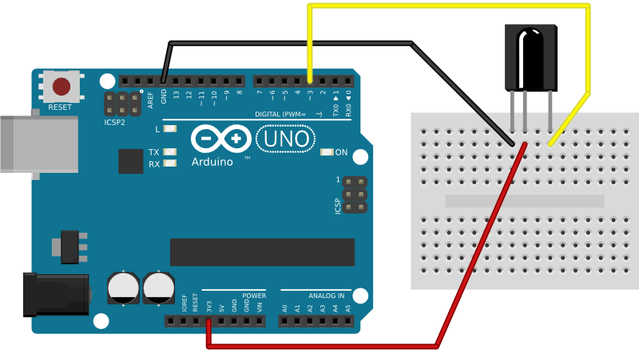

rc4pt-arduino
=============

Remote Controller for PopcornTime using Arduino with IR remote receiver.

Work together with [rc4pt-node](https://github.com/comsolid/rc4pt-node).

## Installation

Download the [Arduino IDE](http://arduino.cc/en/Main/Software).

Clone or [download this project](https://github.com/comsolid/rc4pt-arduino).

Put the code on the Arduino working directory, on Linux at `~/sketchbook`.

Open the Arduino IDE, open `rc4pt-arduino`, compile and upload.

## Breadboard/Illustration

